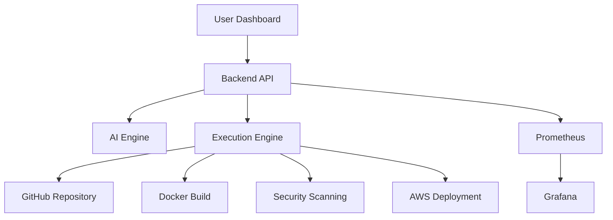

<h1 align="center">🚀 OpsPilot</h1>

<p align="center">
AI-Driven DevSecOps Automation Platform
</p>

<p align="center">
Automate CI/CD • Secure Deployments • Cloud Monitoring • AI Pipelines
</p>

<p align="center">

</p>

---

# 📌 Overview

OpsPilot is an AI-powered DevSecOps Automation Platform designed to simplify software deployment, cloud automation, monitoring, and security integration using natural language commands.

The platform allows developers and DevOps engineers to generate CI/CD pipelines automatically using AI.

Users can deploy applications using commands like:

```bash
Deploy my application to AWS using Docker with security scanning
```

OpsPilot automatically:

- Generates deployment pipelines
- Clones GitHub repositories
- Builds Docker containers
- Performs security scans
- Deploys applications to AWS
- Streams real-time deployment logs
- Monitors infrastructure using Prometheus & Grafana

---

# ✨ Features

| Feature | Description |
|---|---|
| 🤖 AI Pipeline Generation | Generate CI/CD workflows using natural language |
| 🐳 Docker Automation | Automatic image build & deployment |
| 🔐 Security Scanning | SonarQube + Trivy integration |
| ☁️ AWS Deployment | EC2 & ECS deployment automation |
| 📊 Monitoring | Prometheus & Grafana dashboards |
| 📡 Real-Time Logs | WebSocket-based live logs |
| 🌐 Static Hosting | Live deployment hosting support |
| 🔑 RBAC Authentication | Secure JWT authentication |

---

# 🏆 Key Highlights

✅ AI-powered DevSecOps platform  
✅ Real-time deployment monitoring  
✅ Integrated vulnerability scanning  
✅ Dockerized cloud deployments  
✅ AWS infrastructure automation  
✅ Prometheus + Grafana observability  
✅ Live deployment log streaming  
✅ GitHub repository integration  

---

# 🛠️ Tech Stack

<p align="center">
  
</p>

---

# 🏗️ System Architecture



---

# 🔄 Workflow

```text
User Prompt
   ↓
AI Pipeline Generation
   ↓
Repository Cloning
   ↓
Docker Build
   ↓
Security Scanning
   ↓
AWS Deployment
   ↓
Monitoring & Logs
```

---

# 📸 Screenshots

## Dashboard


---

## Monitoring Dashboard


---

## Deployment Logs


---

# 🎥 Demo


---

# 📂 Project Structure

```bash
OpsPilot/
│
├── frontend/
│   ├── src/
│   ├── app/
│   ├── components/
│   └── pages/
│
├── backend/
│   ├── src/
│   │   ├── routes/
│   │   ├── controllers/
│   │   ├── services/
│   │   ├── middleware/
│   │   ├── models/
│   │   └── utils/
│   │
│   └── deployments/
│
├── monitoring/
│   ├── docker-compose.yml
│   ├── prometheus/
│   └── grafana/
│
└── README.md
```

---

# ⚙️ Installation Guide

## 📦 Clone Repository

```bash
git clone https://github.com/your-username/opspilot.git

cd opspilot
```

---

# 🔧 Backend Setup

```bash
cd backend

npm install
```

## Create `.env`

```env
PORT=5001

MONGO_URI=your_mongodb_uri

JWT_SECRET=your_secret

AWS_ACCESS_KEY_ID=your_access_key
AWS_SECRET_ACCESS_KEY=your_secret_key
AWS_REGION=ap-south-1
```

## Start Backend

```bash
npm run dev
```

Backend runs on:

```bash
http://localhost:5001
```

---

# 🎨 Frontend Setup

```bash
cd frontend

npm install

npm run dev
```

Frontend runs on:

```bash
http://localhost:3000
```

---

# 📊 Monitoring Setup

## Start Prometheus & Grafana

```bash
cd monitoring

docker-compose up -d
```

---

## Prometheus Dashboard

```bash
http://localhost:9090
```

---

## Grafana Dashboard

```bash
http://localhost:3001
```

Default Credentials:

```bash
Username: admin
Password: admin
```

---

# 🔍 Metrics Endpoint

```bash
http://localhost:5001/metrics
```

---

# 🔐 Security Integration

## SonarQube

Used for:

- Static Application Security Testing (SAST)
- Code quality analysis
- Vulnerability detection

---

## Trivy

Used for:

- Docker image scanning
- Dependency vulnerability scanning
- Security auditing

---

# ☁️ AWS Deployment

OpsPilot supports:

- AWS EC2
- AWS ECS

Configure AWS CLI:

```bash
aws configure
```

---

# 📡 Real-Time Logs

The platform streams deployment logs in real time using WebSockets.

Users can monitor:

- Docker build logs
- Deployment progress
- Security scan output
- AWS deployment status

directly from the dashboard.

---

# 🌐 Live Static Hosting

OpsPilot supports local hosting of static GitHub repositories.

Deployment directory:

```bash
backend/deployments/{pipelineId}
```

Live URL:

```bash
http://localhost:5001/live/{pipelineId}
```

---

# 📈 Prometheus Metrics

Custom metrics include:

- Pipeline execution count
- Deployment duration
- Vulnerability statistics
- CPU usage
- Memory usage
- Docker build statistics

---

# 🧪 Testing

## Backend Type Check

```bash
npx tsc --noEmit
```

---

## Frontend Build Check

```bash
npm run build
```

---

## Metrics Validation

```bash
curl http://localhost:5001/metrics
```

---

# 🐛 Bug Fixes Implemented

## Backend Fixes

- Duplicate import removal
- TypeScript configuration fixes
- Middleware response handling fixes
- Missing dependency installation

---

## Frontend Fixes

- Sidebar logout functionality
- Client rendering fixes
- Navigation improvements

---

# 💡 Why OpsPilot?

OpsPilot was built to simplify DevSecOps workflows using AI and automation.

The project demonstrates:

- Cloud deployment automation
- Docker containerization
- CI/CD pipeline generation
- Monitoring infrastructure
- Security integration
- AI workflow orchestration

---

# 🚀 Roadmap

- [ ] Kubernetes Integration
- [ ] GitOps Support
- [ ] Multi-cloud Deployment
- [ ] AI Anomaly Detection
- [ ] Terraform Integration
- [ ] Slack/Discord Notifications
- [ ] Jenkins Integration

---

# 📚 Learning Outcomes

This project demonstrates practical implementation of:

- DevOps & DevSecOps
- Cloud Computing
- CI/CD Pipelines
- Docker Containerization
- AWS Deployment
- Monitoring Infrastructure
- Security Automation
- AI Integration
- WebSocket Communication

---

# 🤝 Contributing

Pull requests and suggestions are welcome.

Feel free to fork this repository and contribute improvements.

---

# 👨‍💻 Author

## Rajat Kamboj

B.Tech Student – UPES

### Skills

- DevOps
- Cloud Computing
- Docker & AWS
- Full Stack Development
- Security Automation

---

# 📜 License

This project is developed for educational and learning purposes.

---

# 🙌 Acknowledgements

Special thanks to:

- Docker Community
- AWS Documentation
- MongoDB Documentation
- Node.js Community
- Prometheus & Grafana Labs
- SonarQube
- Trivy
- Open Source Contributors

---

# ⭐ Support

If you like this project, give it a ⭐ on GitHub!
